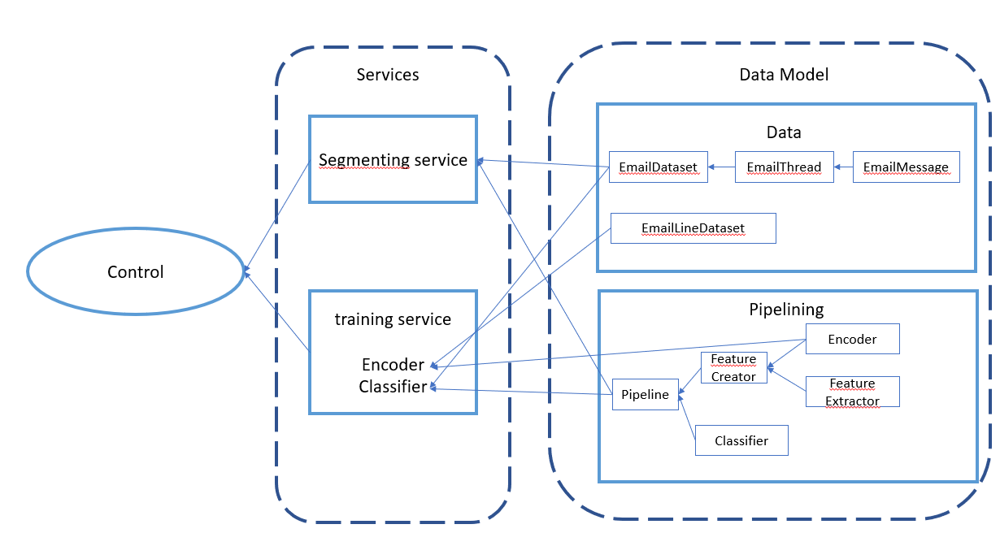

# email_cleaning_service

This is an email segmenting service which takes a list of emails as input and returns the the header, body and signature of each message in the email

## Getting Started

The project is published on Pypi and can be installed using the following command

```py
pip install email-cleaning-service
```

## Usage

The package can be used as follows
```py
from email_cleaning_service.control import EmailCleaner

email_cleaner = EmailCleaner(tracking_uri, storage_uri)
```

Usage revolves around the emailCleaner classwhich is the preferred interface for the package. The class takes two arguments, the tracking_uri and the storage_uri. The tracking_uri is the uri of the MLflow tracking server and the storage_uri is the uri of the storage server (can be a path to a local folder).

BaseModel classes exist to simplify interactions with the class. The most important of these is the PipelineSpecs class which is used to define the pipeline to be used for cleaning the emails.

```py
from email_cleaning_service.utils.request_classes import PipelineSpecs

pipeline_specs = PipelineSpecs(
    classifier_origin="mlflow", # or "hugg" or "h5"
    classifier_id="a1f66311816e417cb94db7c2457b25d1",
    encoder_origin="hugg", # or "mlflow"
    encoder_id="sentence-transformers/paraphrase-multilingual-MiniLM-L12-v2",
    encoder_dim=384,
    features=[
            "phone_number",
            "url",
            "punctuation",
            "horizontal_separator",
            "hashtag",
            "pipe",
            "email",
            "capitalized",
            "full_caps"
        ]      # Can be any combination of the above features
)
```

## Package Structure



## Known Issues


